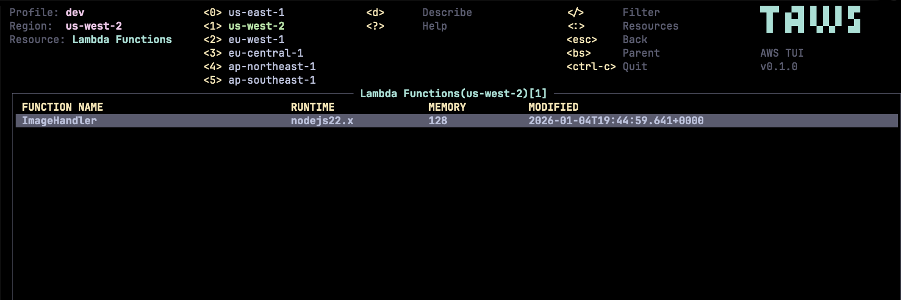

<p align="center">
  
</p>

# taws - Terminal UI for AWS

**taws** provides a terminal UI to interact with your AWS resources. The aim of this project is to make it easier to navigate, observe, and manage your AWS infrastructure in the wild.

---

[](LICENSE)
[](https://www.rust-lang.org/)

---

## Screenshots

<p align="center">
  
</p>

<p align="center">
  
</p>

---

## Features

- **Multi-Profile Support** - Easily switch between AWS profiles
- **Multi-Region Support** - Navigate across different AWS regions
- **94+ Resource Types** - Browse and manage resources across 60+ AWS services
- **Manual Refresh** - Refresh resources with a single keystroke
- **Pagination** - Navigate through large resource lists with `]` / `[` keys
- **Keyboard-Driven** - Vim-like navigation and commands
- **Resource Actions** - Start, stop, terminate EC2 instances directly
- **Detailed Views** - JSON/YAML view of resource details
- **Filtering** - Filter resources by name or attributes
- **Autocomplete** - Smart resource type autocomplete with fuzzy matching

---

## Installation

### Homebrew (macOS/Linux)

```bash
brew install huseyinbabal/tap/taws
```

### Scoop (Windows)

```powershell
scoop bucket add huseyinbabal https://github.com/huseyinbabal/scoop-bucket
scoop install taws
```

### Download Pre-built Binaries

Download the latest release from the [Releases page](https://github.com/huseyinbabal/taws/releases/latest).

| Platform | Architecture | Download |
|----------|--------------|----------|
| **macOS** | Apple Silicon (M1/M2/M3) | `taws-aarch64-apple-darwin.tar.gz` |
| **macOS** | Intel | `taws-x86_64-apple-darwin.tar.gz` |
| **Linux** | x86_64 | `taws-x86_64-unknown-linux-gnu.tar.gz` |
| **Linux** | ARM64 | `taws-aarch64-unknown-linux-gnu.tar.gz` |
| **Windows** | x86_64 | `taws-x86_64-pc-windows-msvc.zip` |

#### Quick Install (macOS/Linux)

```bash
# macOS Apple Silicon
curl -sL https://github.com/huseyinbabal/taws/releases/latest/download/taws-aarch64-apple-darwin.tar.gz | tar xz
sudo mv taws /usr/local/bin/

# macOS Intel
curl -sL https://github.com/huseyinbabal/taws/releases/latest/download/taws-x86_64-apple-darwin.tar.gz | tar xz
sudo mv taws /usr/local/bin/

# Linux x86_64
curl -sL https://github.com/huseyinbabal/taws/releases/latest/download/taws-x86_64-unknown-linux-gnu.tar.gz | tar xz
sudo mv taws /usr/local/bin/

# Linux ARM64
curl -sL https://github.com/huseyinbabal/taws/releases/latest/download/taws-aarch64-unknown-linux-gnu.tar.gz | tar xz
sudo mv taws /usr/local/bin/
```

#### Windows

1. Download `taws-x86_64-pc-windows-msvc.zip` from the [Releases page](https://github.com/huseyinbabal/taws/releases/latest)
2. Extract the zip file
3. Add the extracted folder to your PATH, or move `taws.exe` to a directory in your PATH

### Using Cargo

```bash
cargo install taws
```

### From Source

taws is built with Rust. Make sure you have Rust 1.70+ installed, along with a C compiler and linker.

#### Build Dependencies

| Platform | Install Command |
|----------|-----------------|
| **Amazon Linux / RHEL / Fedora** | `sudo yum groupinstall "Development Tools" -y` |
| **Ubuntu / Debian** | `sudo apt update && sudo apt install build-essential -y` |
| **macOS** | `xcode-select --install` |
| **Windows** | Install [Visual Studio Build Tools](https://visualstudio.microsoft.com/visual-cpp-build-tools/) |

```bash
# Clone the repository
git clone https://github.com/huseyinbabal/taws.git
cd taws

# Build and run
cargo build --release
./target/release/taws
```

---

## Prerequisites

- **AWS Credentials** - See [Authentication](#authentication) section below
- **IAM Permissions** - Your AWS user/role needs appropriate read permissions for the services you want to browse. At minimum, you'll need `Describe*` and `List*` permissions.

---

## Authentication

taws uses a credential chain, trying each source in order:

| Priority | Source | Description |
|----------|--------|-------------|
| 1 | Environment Variables | `AWS_ACCESS_KEY_ID`, `AWS_SECRET_ACCESS_KEY`, `AWS_SESSION_TOKEN` |
| 2 | **AWS SSO** | If profile has SSO configured, uses SSO (prompts for login if needed) |
| 3 | Credentials File | `~/.aws/credentials` |
| 4 | Config File | `~/.aws/config` |
| 5 | IMDSv2 | EC2 instance metadata |

### AWS SSO

taws supports AWS SSO. If your profile uses SSO and the token is expired, taws will prompt you to authenticate via browser.

Both SSO config formats are supported:
- Modern: `sso_session` reference to `[sso-session X]` section
- Legacy: `sso_start_url` directly in profile

If you already logged in via `aws sso login`, taws will use the cached token automatically.

---

## Quick Start

```bash
# Launch taws with default profile
taws

# Launch with a specific profile
taws --profile production

# Launch in a specific region
taws --region us-west-2

# Enable debug logging
taws --log-level debug

# Run in read-only mode (blocks all write operations)
taws --readonly

# Use with LocalStack or custom endpoint
taws --endpoint-url http://localhost:4566

# Or via environment variable
AWS_ENDPOINT_URL=http://localhost:4566 taws
```

### Log File Locations

| Platform | Path |
|----------|------|
| **Linux** | `~/.config/taws/taws.log` |
| **macOS** | `~/Library/Application Support/taws/taws.log` |
| **Windows** | `%APPDATA%\taws\taws.log` |

---

## Key Bindings

| Action | Key | Description |
|--------|-----|-------------|
| **Navigation** | | |
| Move up | `k` / `↑` | Move selection up |
| Move down | `j` / `↓` | Move selection down |
| Top | `gg` | Jump to first item |
| Bottom | `G` | Jump to last item |
| **Pagination** | | |
| Next page | `]` | Load next page of results |
| Previous page | `[` | Load previous page of results |
| **Views** | | |
| Resource picker | `:` | Open resource type selector |
| Describe | `Enter` / `d` | View resource details |
| Back | `Esc` / `Backspace` | Go back to previous view |
| Help | `?` | Show help screen |
| **Actions** | | |
| Refresh | `R` | Refresh current view (resets pagination) |
| Filter | `/` | Filter resources |
| Region shortcuts | `0-5` | Quick switch to common regions |
| Quit | `Ctrl-c` | Exit taws |
| **EC2 Actions** | | |
| Start instance | `s` | Start selected EC2 instance |
| Stop instance | `S` | Stop selected EC2 instance |
| Terminate | `T` | Terminate selected EC2 instance |

---

## Resource Navigation

Press `:` to open the resource picker. Type to filter resources:

```
:ec2          # EC2 Instances
:lambda       # Lambda Functions
:s3           # S3 Buckets
:rds          # RDS Instances
:iam-users    # IAM Users
:eks          # EKS Clusters
```

Use `Tab` to autocomplete and `Enter` to select.

---

## Supported AWS Services

taws supports **30 AWS services** with **49 resource types** covering 95%+ of typical AWS usage:

| Category | Service | Resources |
|----------|---------|-----------|
| **Compute** | EC2 | Instances |
| | Lambda | Functions |
| | ECS | Clusters, Services, Tasks |
| | EKS | Clusters |
| | Auto Scaling | Auto Scaling Groups |
| **Storage** | S3 | Buckets |
| **Database** | RDS | Instances, Snapshots |
| | DynamoDB | Tables |
| | ElastiCache | Clusters |
| **Networking** | VPC | VPCs, Subnets, Security Groups |
| | ELBv2 | Load Balancers, Listeners, Rules, Target Groups, Targets |
| | Route 53 | Hosted Zones |
| | CloudFront | Distributions |
| | API Gateway | REST APIs |
| **Security** | IAM | Users, Groups, Roles, Policies, Access Keys |
| | Secrets Manager | Secrets |
| | KMS | Keys |
| | ACM | Certificates |
| | Cognito | User Pools |
| **Management** | CloudFormation | Stacks |
| | CloudWatch | Log Groups |
| | CloudTrail | Trails |
| | SSM | Parameters |
| | STS | Caller Identity |
| **Messaging** | SQS | Queues |
| | SNS | Topics |
| | EventBridge | Event Buses, Rules |
| **Containers** | ECR | Repositories |
| **DevOps** | CodePipeline | Pipelines |
| | CodeBuild | Projects |
| **Analytics** | Athena | Workgroups |

> **Missing a service?** [Start a discussion](https://github.com/huseyinbabal/taws/discussions/new?category=ideas) to propose adding it!

---

## Configuration

See [Authentication](#authentication) for credential setup.

### Environment Variables

| Variable | Description |
|----------|-------------|
| `AWS_PROFILE` | Default AWS profile to use |
| `AWS_REGION` | Default AWS region |
| `AWS_DEFAULT_REGION` | Fallback region (if `AWS_REGION` not set) |
| `AWS_ACCESS_KEY_ID` | AWS access key |
| `AWS_SECRET_ACCESS_KEY` | AWS secret key |
| `AWS_SESSION_TOKEN` | AWS session token (for temporary credentials) |
| `AWS_ENDPOINT_URL` | Custom endpoint URL (for LocalStack, etc.) |

---

## Known Issues

- Some resources may require specific IAM permissions not covered by basic read-only policies
- Total resource count is not displayed due to AWS API limitations (most AWS APIs don't return total count)
- Some global services (IAM, Route53, CloudFront) always use us-east-1

---

## Contributing

Contributions are welcome! Please see our [Contributing Guide](CONTRIBUTING.md) for details.

**Important:** Before adding a new AWS service, please [start a discussion](https://github.com/huseyinbabal/taws/discussions/new?category=ideas) first.

---

## Acknowledgments

- Inspired by [k9s](https://github.com/derailed/k9s) - the awesome Kubernetes CLI
- Built with [Ratatui](https://github.com/ratatui-org/ratatui) - Rust TUI library
- Uses [aws-sigv4](https://github.com/awslabs/aws-sdk-rust) for request signing

---

## License

This project is licensed under the MIT License - see the [LICENSE](LICENSE) file for details.

---

<p align="center">
  Made with ❤️ for the AWS community
</p>
